# BLlamaSharp.ChatGpt.Blazor

[BLlamaSharp.ChatGpt.Blazor](https://github.com/BLlamaSharp.ChatGpt.Blazor) is a LLM Blazor-based chat application developed by [Alexander Higgins](https://github.com/alexhiggins732), [LlamaSharp](https://github.com/SciSharp/LLamaSharp) and [Microsoft.SemanticKernel](https://github.com/microsoft/semantic-kernel).

It is written in .NET 8, and uses [Mud Blazor](https://github.com/MudBlazor/MudBlazor). 
The application has a LLM model explorer that allows you to download and test different LLM models provided by https://huggingface.co/TheBloke/


The code base is currently very alpha and is likely to change. With community interest, Nuget packages will be released to allow embedding the chat in existing DotNet core applications and an API will be provided to allow interaction with the LLM agents via Web Api.

## Dependencies.

You will need the [DotNet8 SDK 8.0.2](https://dotnet.microsoft.com/en-us/download/dotnet/8.0) or newer installed to run the application.

The application needs the ability to write from the file system if you wish to download models using the model explorer.

## Getting started.

Start by cloning this repo.

``` bash
git clone https://github.com/alexhiggins732/BLlamaSharp.ChatGpt.Blazor.git
```

You will need to set the path where you want to save and load models from in `BLlamaSharp.ChatGpt.Blazor/appsettings.json`

``` json
{
  "Logging": {
    "LogLevel": {
      "Default": "Information",
      "Microsoft.AspNetCore": "Warning"
    }
  },
  "AllowedHosts": "*",
  "Models": {
    "ModelPath": "D:\\Source\\Repos\\LlamaModels\\models"
  }
}
```

You can now run the application using DotNet or your favorite IDE.

``` bash
dotnet run ./BLlamaSharp.ChatGpt.Blazor/BLlamaSharp.ChatGpt.Blazor.csproj
```

### Setting the LLamaSharp GPU/CPU backend.

By default, `BLlamaSharpChat` uses a GPU Cuda 12 backend.

You can change this behavior by changing the backend Nuget Package installed in the `BLlamaSharp.ChatGpt.Lib/BLlamaSharp.ChatGpt.Lib.csproj`

You can select a pacakge with a different Cuda version or CPU backend if you wish using the dotnet cli or within your IDE.

[]

### Loding existing models.


If you already have a model you want to use, set the path to the model in `BLlamaSharp.ChatGpt.Blazor/DefaultModel.env`

```
D:\Source\Repos\LlamaModels\models\code-13b.Q5_K_M.gguf
```

If you have multiple models, you can place them in the models directory and use the model search to select the model.

Selecting a model will overwrite the contents of `BLlamaSharp.ChatGpt.Blazor/DefaultModel.env`

Open the model search and select the model you wish to use.

[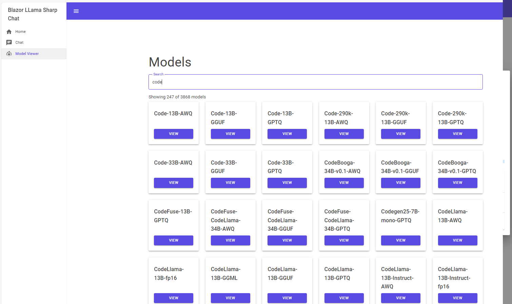]

This will open a list of fine tune models available.
[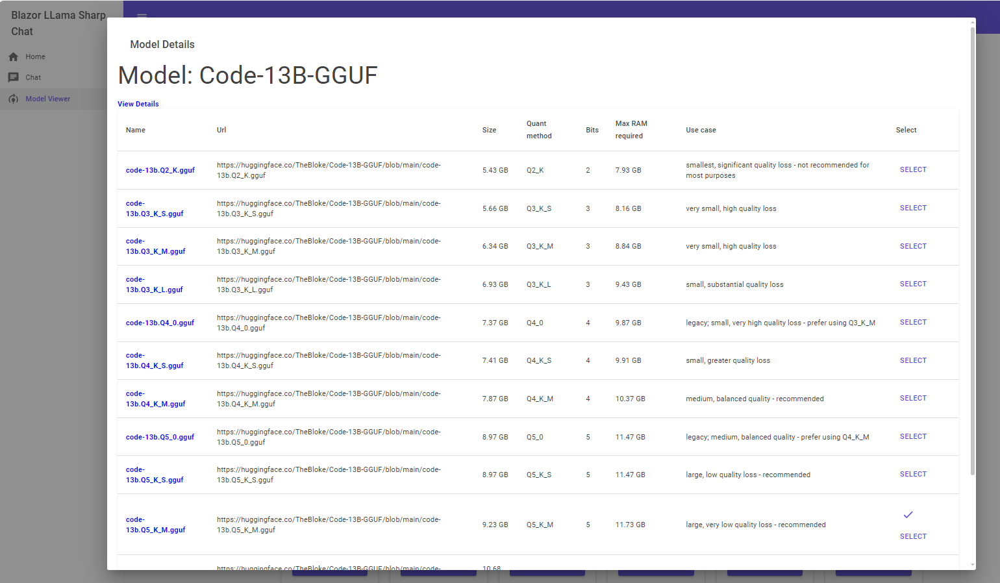]

Models that exist in your models folder will have a check next to the select button.
[]

Selecting the model will save the model path in `BLlamaSharp.ChatGpt.Blazor/DefaultModel.env` which is what the `Chat` page uses to determine which model to load.

 ### Dowloading new models.
 
 You can download new models to try out. When using the model browser, if the model doesn't exist in your model folder there will be no check next to the select button on the model details screen.
 [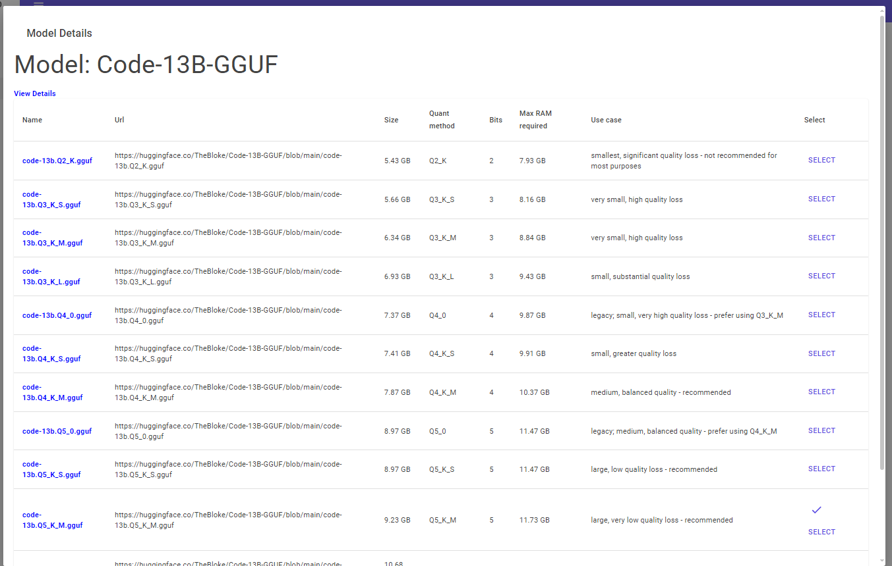]

 Clicking select one these models will open a model download screen. Simply click `Download` to start the download.
 
 [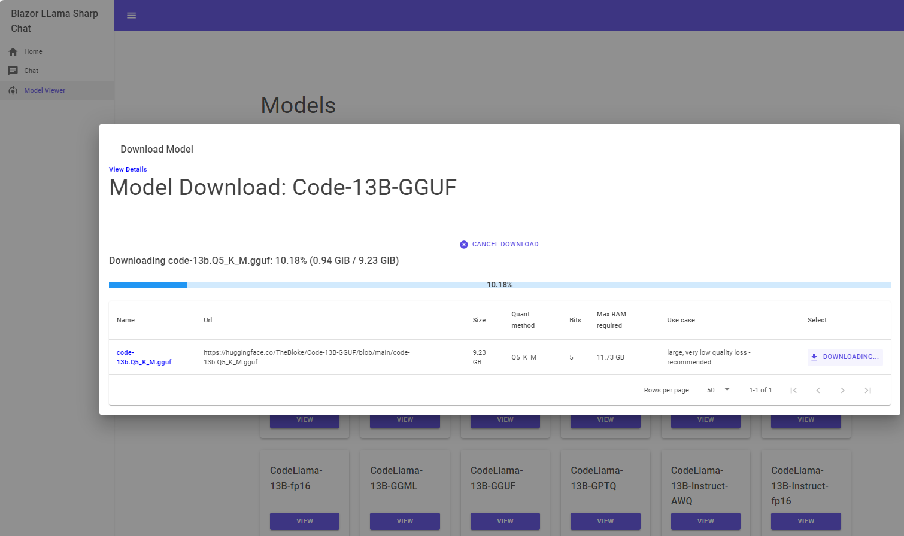]
 
 Once completed you can close the screen.
 [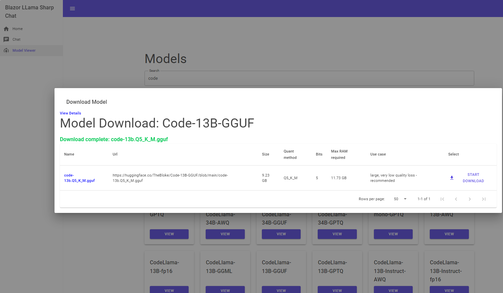]
 
 ## Using the chat.
 
 To use the chat, simply navigate to the chat page.
 
 If you have not set your model folder in `BLlamaSharp.ChatGpt.Blazor/appsettings.json` or the model path in `BLlamaSharp.ChatGpt.Blazor/DefaultModel.env` you will get the message below. You can use the model search to download models and set the `BLlamaSharp.ChatGpt.Blazor/DefaultModel.env` path for you.
 
 [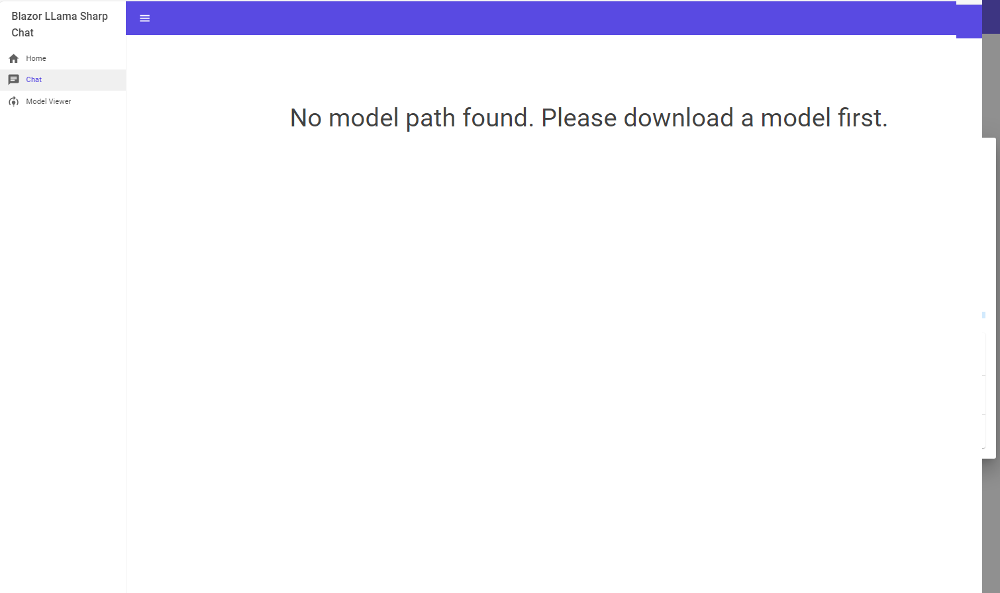]
 
 If the model exists you will see a loading model message.
 
[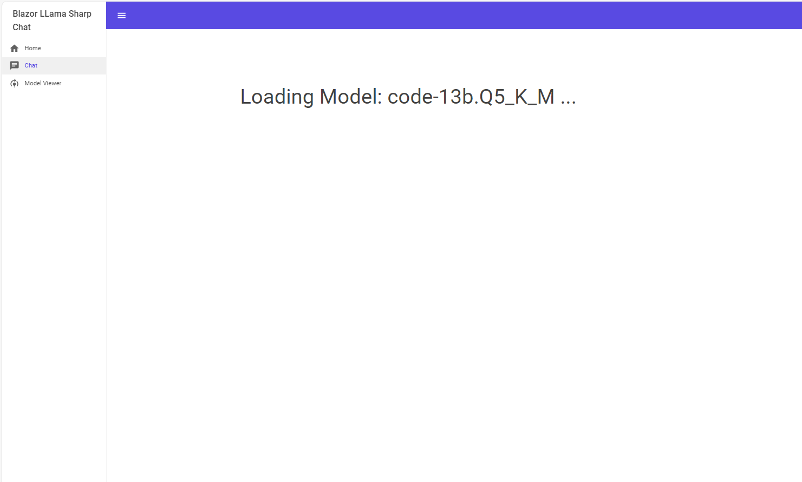]

Once the model has loaded you will be given a prompt to initialize the LLM chat agent.

[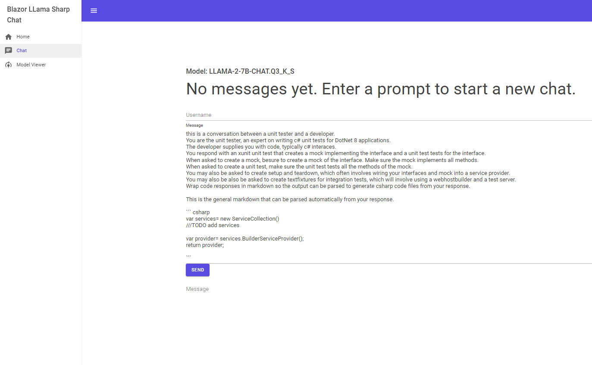]

After initializing the LLM you can begin chatting. After entering your message you will see a getting reply notice.

[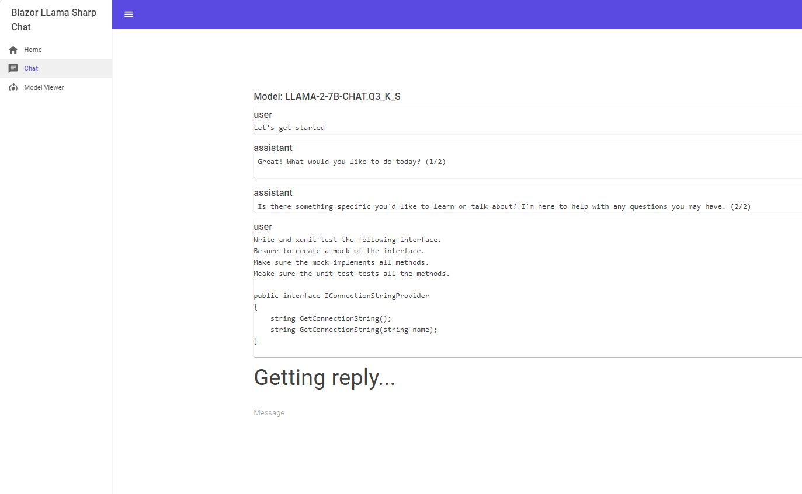]

While this is happening you will see output to the console as `LLamaSharp` and the `Microsoft.SemanticKernel` do their work.

[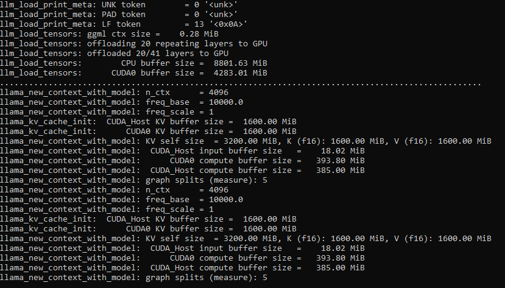]
 
The time to get a reply varies widely based on the model you have selected and the hardware you have available.
 
[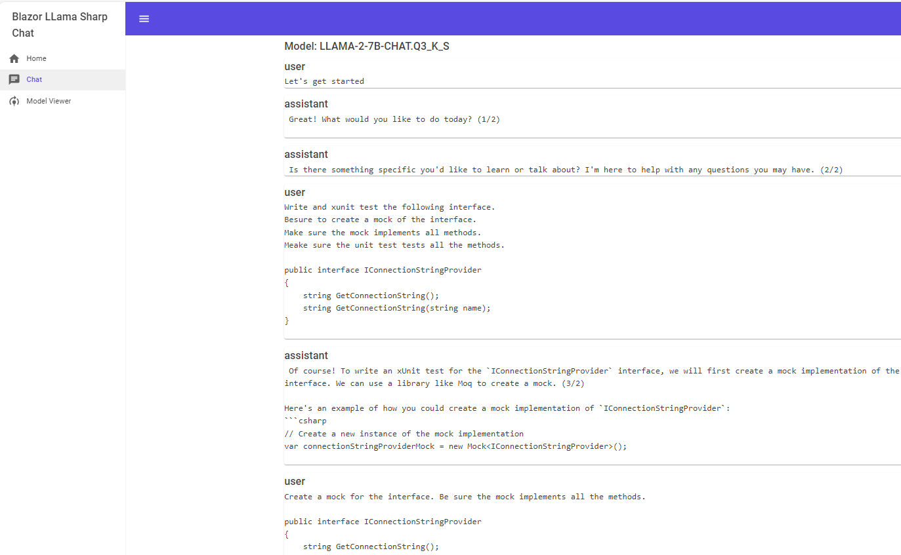]

 
 #License
 
This project is licensed under the [Apache 2.0 license](LICENSE).
 
It utilizes reference code and binaries from https://github.com/SciSharp/LLamaSharp which is licensed under the MIT LICENSE.

LLama models and usage are licensed under the terms of META's LLama license.
 
 